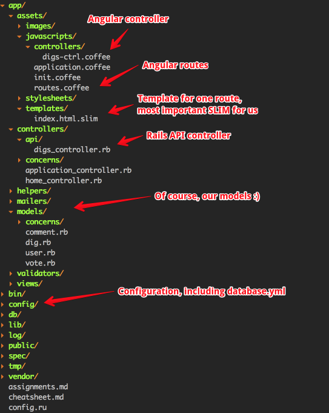

# KNTAW
This application was created for learning purposes for `Koło Naukowe Tworzenia Aplikacji Webowych`: the academic circle in Politechnika Wrocławska.

# WykopApp
This application is the changed verion of [pwr-workshop-2](https://github.com/hussar-academy/pwr-workshop-2). You can see the list of most changes in [this pull request](https://github.com/hussar-academy/pwr-workshop-3/pull/1/files).

# Setup

```
$ git clone git@github.com:hussar-academy/pwr-workshop-3.git
$ cd pwr-workshop-3
$ bundle install
$ bundle exec rake db:setup
$ bundle exec rails s
```

## Database

The default database adapter is MySQL. If you want to use Postgresql or SQLite you can find configs in `config/` directory.

```
$ ls config/
database.yml
database.psql.yml
database.sqlite.yml
```

The `database.yml` file is config that is used, so you can just replace it with the one you wish to use.

# [Assignments](https://github.com/hussar-academy/pwr-workshop-3/blob/master/assignments.md)

Assignments to solve.

# [Cheatsheet](https://github.com/hussar-academy/pwr-workshop-3/blob/master/cheatsheet.md)

Cheatsheet with tips helpful in solving the assignments.



# Feedback

We would love your feedback after the workshop. It's very important to us, so we can improve for our next meetings :)

